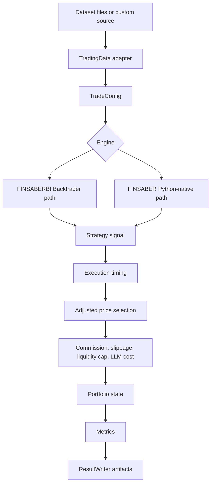

# Architecture

FINSABER separates the reusable backtesting framework from research strategy implementations. The package boundary is the `backtest` package; examples, LLM agents, RL agents, and experiment launchers remain repository-level research code.

## Core Flow



1. `TradingData` provides date-indexed market data and optional modalities such as news, filings, and earnings calls.
2. `TradeConfig` normalizes run parameters, including tickers, date range, cash, execution timing, costs, liquidity controls, and result output paths.
3. `FINSABERBt` or `FINSABER` iterates through tickers, windows, or selected universes.
4. Strategies read only the data exposed for the current decision point.
5. Execution utilities apply timing, adjusted prices, commission, slippage, and liquidity caps.
6. Metrics and artifacts are written to a structured run directory when `save_results=True`.

## Engines

Use `FINSABERBt` for Backtrader-compatible strategies. It converts loader output into Backtrader feeds, configures broker costs, runs each ticker or window, then extracts broker/analyzer results.

Use `FINSABER` for Python-native strategies and LLM-style agents. It exposes daily data to strategy `on_data` logic and routes orders through `BacktestFrameworkIso`, which controls fills, position updates, rejected orders, and cost accounting.

!!! tip "Choosing an engine"
    Use `FINSABERBt` when your strategy already follows Backtrader's `next()` loop. Use `FINSABER` when an agent needs direct access to daily dictionaries containing price, news, filings, or extra modalities.

## Package Boundary

The installable package exposes stable framework pieces:

```text
backtest/
  data_util/      TradingData adapters
  toolkit/        config, execution, metrics, result writing, LLM cost tracking
  strategy/       reusable base strategies and selectors
  finsaber.py     Python-native engine
  finsaber_bt.py  Backtrader engine
```

Paper-specific integrations such as FinMem, FinAgent, FinCon, and FinRL live outside the core package. They can depend on public APIs, but the package should not import them at module import time.

## Correctness Principles

Backtests should state when a decision is made and when an order fills. For date-level features, prefer `execution_timing="next_open"` because news and filings usually do not have reliable intraday availability. Use adjusted OHLC for split-adjusted simulation, but retain raw volume for liquidity limits. Liquidity and rolling statistics must use prior bars only.

!!! warning "Bias controls"
    Do not rank tickers, compute liquidity, or construct features from data outside the current training or decision window. If exact announcement timestamps are unavailable, treat date-only text as available from the next decision point.

## Extension Points

Add new datasets by implementing `TradingData`. Add new strategies by subclassing the appropriate base strategy. Add new execution assumptions in `backtest/toolkit/execution.py` and expose them through `TradeConfig` so the assumption is visible in saved run configuration.
