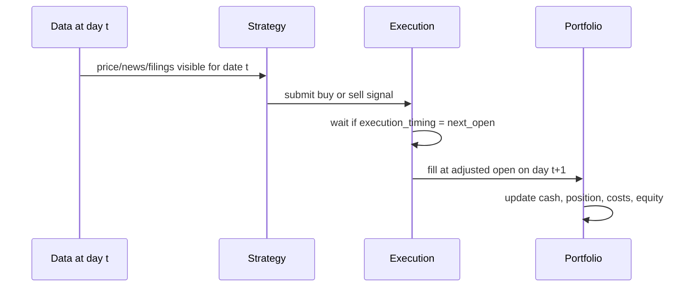

# Backtesting Concepts

This page explains the vocabulary used by FINSABER. If you are new to systematic trading, read this before writing a strategy.

## What A Backtest Does

A backtest replays historical market data and asks: "If this strategy had made decisions using only information available at the time, what trades would it have made and what would the portfolio have been worth?"

FINSABER makes the important assumptions explicit:

- When the strategy sees information.
- When an order is filled.
- Which price is used for the fill.
- How commission, slippage, liquidity, and LLM cost are charged.
- Where outputs are saved for audit and analysis.

## Core Terms

| Term | Meaning in FINSABER |
| --- | --- |
| Bar | One daily price record for a ticker, usually open, high, low, close, adjusted close, and volume. |
| Signal | A strategy decision, such as "buy AAPL" or "sell MSFT". |
| Order | The requested trade sent to the framework after a signal. |
| Fill | The executed trade after timing, price, cash, liquidity, commission, and slippage rules are applied. |
| Position | Current shares held for a ticker. |
| Cash | Uninvested portfolio cash after buys, sells, and costs. |
| Equity curve | Portfolio value through time: cash plus marked-to-market holdings. |
| Universe | The set of tickers allowed in a run. |
| Selector | A component that chooses a subset of tickers for a period. |
| Window | A date range used for one run or one rolling-period evaluation. |

## Daily Timeline

For date-level data such as daily prices, news, and SEC filings, exact intraday availability is often unknown. The safest default is to generate a signal on day `t` and trade at the next available open.

Use `same_close` only when your features are genuinely available before the same day's close. If in doubt, use `next_open`.

## Financial Assumptions

FINSABER separates market assumptions from strategy logic. A strategy should decide what it wants to do; the execution model decides what actually happens.

| Assumption | Why it matters |
| --- | --- |
| Adjusted prices | Stock splits can make raw prices look like huge losses. Adjusted OHLC keeps simulation prices split-adjusted. |
| Commission | Every trade costs money; ignoring it overstates high-turnover strategies. |
| Slippage | The fill price is usually worse than the quoted price, especially for large orders. |
| Liquidity cap | A strategy should not buy more shares than the market could realistically absorb. |
| LLM cost | If a strategy pays for model calls, that is an economic cost and can be counted alongside trading costs. |

## Common Biases

!!! warning "Backtests can look good for the wrong reason"
    Strong performance is not meaningful unless the data, timing, and universe rules prevent future information from leaking into past decisions.

| Bias | Example | Safer practice |
| --- | --- | --- |
| Look-ahead bias | Reading tomorrow's filing while trading today. | Use only data available at the decision date. |
| Same-day text leakage | Using a date-only news article and filling at the same close. | Prefer `next_open` unless timestamps prove availability. |
| Survivorship bias | Testing only tickers that survived until today. | Use a historically correct universe when possible. |
| Split error | Treating a 2-for-1 split as a 50% crash. | Use adjusted OHLC for returns and fills. |
| Liquidity bias | Buying 20% of daily volume at the close price with no impact. | Enable liquidity caps and slippage. |
| Selection bias | Ranking tickers using the whole test period. | Select tickers using only the training or prior window. |

## Choosing The Right Engine

Use `FINSABERBt` when your strategy is naturally written as a Backtrader `next()` loop or uses Backtrader indicators.

Use `FINSABER` when your strategy consumes daily dictionaries directly, such as LLM agents that read price, news, filings, and extra modalities.
