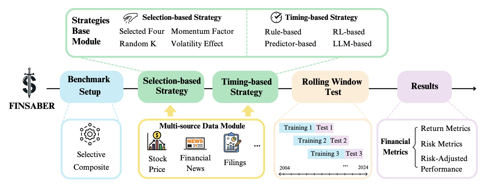
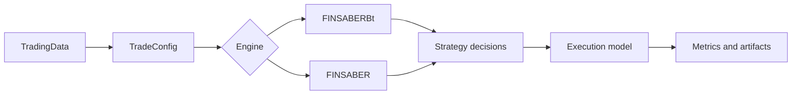

<section class="finsaber-hero">
  <span class="finsaber-eyebrow">FINSABER-2</span>
  <h1>Financial backtesting, made explicit.</h1>
  <p>
    A package-oriented framework for evaluating strategies over prices, news, filings, and extensible market data
    with clear timing, adjustment, liquidity, slippage, and LLM-cost assumptions.
  </p>
  <div class="finsaber-actions">
    <a class="md-button md-button--primary" href="quickstart/">Run a backtest</a>
    <a class="md-button" href="architecture/">Understand the framework</a>
    <a class="md-button" href="api/">View API reference</a>
  </div>
</section>

# FINSABER

FINSABER is a research framework for evaluating financial trading strategies over price, news, filings, and extensible market data. FINSABER-2 upgrades the original FINSABER code into a package-oriented backtesting framework with explicit execution assumptions and structured result artifacts.

<div class="finsaber-metric-row">
  <div class="finsaber-metric"><strong>2</strong><span>Backtest engines</span></div>
  <div class="finsaber-metric"><strong>4+</strong><span>Data modalities</span></div>
  <div class="finsaber-metric"><strong>5</strong><span>Cost controls</span></div>
  <div class="finsaber-metric"><strong>CSV/JSON</strong><span>Result artifacts</span></div>
</div>

## Framework Highlights

<div class="finsaber-grid">
  <a class="finsaber-card" href="concepts/">
    <h3>Beginner concepts</h3>
    <p>Learn signals, orders, fills, positions, equity curves, timing, and common backtesting biases.</p>
  </a>
  <a class="finsaber-card" href="data/">
    <h3>Pluggable market data</h3>
    <p>Use the built-in parquet and dictionary loaders, or implement <code>TradingData</code> for private datasets.</p>
  </a>
  <a class="finsaber-card" href="execution/">
    <h3>Explicit execution</h3>
    <p>Choose <code>next_open</code> or <code>same_close</code>, adjusted prices, commission, slippage, liquidity caps, and LLM costs.</p>
  </a>
  <a class="finsaber-card" href="strategies/">
    <h3>Strategy extension points</h3>
    <p>Run Backtrader strategies, Python-native agents, LLM loops, and rolling-window ticker selectors.</p>
  </a>
  <a class="finsaber-card" href="results/">
    <h3>Structured results</h3>
    <p>Analyze stable CSV and JSON artifacts for metrics, trades, orders, equity curves, rejected orders, and costs.</p>
  </a>
</div>

## Recommended Reading Path

If you are new to the framework, read in this order:

1. [Backtesting Concepts](concepts.md) for finance and backtesting vocabulary.
2. [Quick Start](quickstart.md) to run a short buy-and-hold example.
3. [Configuration](configuration.md) to understand every important run setting.
4. [Data](data.md) and [Strategies](strategies.md) when plugging in your own dataset or model.
5. [Execution Model](execution.md) and [Results](results.md) before interpreting performance.

The installable wheel intentionally focuses on reusable backtesting infrastructure. Paper-specific FinMem, FinAgent, FinCon, and FinRL integrations remain available in the repository, but the package exports data loaders, execution models, metrics, result writers, selectors, and strategy interfaces.

## Workflow

The repository includes the original FINSABER pipeline figure:

{ .finsaber-figure }

At the framework level, the upgraded backtesting path follows this lifecycle:



The dataset implements `TradingData`, the config defines the market universe and execution assumptions, the engine iterates through dates and tickers, the strategy emits decisions, and the execution layer applies fills, costs, liquidity constraints, and metrics. See [Architecture](architecture.md) for the detailed lifecycle.

## Start Quickly

=== "Package usage"

    ```python
    from finsaber import FINSABERBt, FinsaberParquetDataset
    from finsaber.strategy.timing import BuyAndHoldStrategy

    data = FinsaberParquetDataset(r"I:\Data\finsaber2\sp500_2000_2025_parquet")

    config = {
        "data_loader": data,
        "tickers": ["AAPL"],
        "date_from": "2024-01-02",
        "date_to": "2024-01-10",
        "setup_name": "demo",
        "execution_timing": "next_open",
        "save_results": True,
        "silence": True,
    }

    results = FINSABERBt(config).run_iterative_tickers(BuyAndHoldStrategy)
    print(results["AAPL"]["total_return"])
    ```

=== "Custom data"

    ```python
    from finsaber import TradingData

    class MyDataset(TradingData):
        def get_data_by_date(self, date):
            return {"price": {}, "news": {}, "filing_k": {}, "filing_q": {}}
    ```

=== "Custom strategy"

    ```python
    from finsaber.strategy.timing_llm import BaseStrategyIso

    class MyAgent(BaseStrategyIso):
        def on_data(self, date, today_data, framework):
            price = today_data["price"]["AAPL"]["adjusted_close"]
            framework.buy(date, "AAPL", price, -1)
    ```

## Engines

Use `FINSABERBt` for Backtrader-compatible timing strategies and baseline technical strategies.

Use `FINSABER` for Python-native or LLM-style strategies that consume date-level data and submit orders through the framework object.
