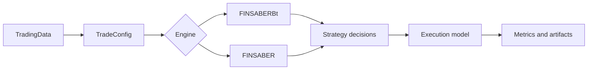

<section class="finsaber-hero">
  <span class="finsaber-eyebrow">FINSABER v2.0</span>
  <h1>Backtesting financial strategies with explicit data, execution, and cost assumptions.</h1>
  <p>
    FINSABER upgrades the original research code into a package-oriented framework for evaluating
    price, news, filings, and extensible market data without hiding timing, adjustment, or trading-cost rules.
  </p>
  <div class="finsaber-actions">
    <a class="md-button md-button--primary" href="quickstart/">Run a backtest</a>
    <a class="md-button" href="architecture/">Understand the framework</a>
    <a class="md-button" href="api/">View API reference</a>
  </div>
</section>

# FINSABER

FINSABER is a research framework for evaluating financial trading strategies over price, news, filings, and extensible market data. The `v2.0` branch upgrades the original FINSABER code into a package-oriented backtesting framework with explicit execution assumptions and structured result artifacts.

<div class="finsaber-metric-row">
  <div class="finsaber-metric"><strong>2</strong><span>Backtest engines</span></div>
  <div class="finsaber-metric"><strong>4+</strong><span>Data modalities</span></div>
  <div class="finsaber-metric"><strong>5</strong><span>Cost controls</span></div>
  <div class="finsaber-metric"><strong>CSV/JSON</strong><span>Result artifacts</span></div>
</div>

## What Is Included

<div class="finsaber-grid">
  <a class="finsaber-card" href="data/">
    <h3>Pluggable market data</h3>
    <p>Use the built-in parquet and dictionary loaders, or implement <code>TradingData</code> for private datasets.</p>
  </a>
  <a class="finsaber-card" href="execution/">
    <h3>Explicit execution</h3>
    <p>Choose <code>next_open</code> or <code>same_close</code>, adjusted prices, commission, slippage, liquidity caps, and LLM costs.</p>
  </a>
  <a class="finsaber-card" href="strategies/">
    <h3>Strategy extension points</h3>
    <p>Run Backtrader strategies, Python-native agents, LLM loops, and rolling-window ticker selectors.</p>
  </a>
  <a class="finsaber-card" href="results/">
    <h3>Structured results</h3>
    <p>Analyze stable CSV and JSON artifacts for metrics, trades, orders, equity curves, rejected orders, and costs.</p>
  </a>
</div>

## Package Boundary

The wheel intentionally excludes paper-specific agent and RL implementations:

- `llm_traders/`
- `rl_traders/`
- experiment runner scripts
- generated outputs and private datasets

Those integrations remain available in the repository for research experiments, but the package focuses on reusable backtesting infrastructure.

## How The Framework Works

FINSABER follows a simple pipeline:



The dataset implements `TradingData`, the config defines the market universe and execution assumptions, the engine iterates through dates and tickers, the strategy emits decisions, and the execution layer applies fills, costs, liquidity constraints, and metrics. See [Architecture](architecture.md) for the detailed lifecycle.

## Typical Workflow

=== "Package usage"

    ```python
    from backtest import FINSABERBt, FinsaberParquetDataset
    from backtest.strategy.timing import BuyAndHoldStrategy

    data = FinsaberParquetDataset(r"I:\Data\finsaber2\sp500_2000_2025_parquet")

    config = {
        "data_loader": data,
        "tickers": ["AAPL"],
        "date_from": "2024-01-02",
        "date_to": "2024-01-10",
        "setup_name": "demo",
        "execution_timing": "next_open",
        "save_results": True,
        "silence": True,
    }

    results = FINSABERBt(config).run_iterative_tickers(BuyAndHoldStrategy)
    print(results["AAPL"]["total_return"])
    ```

=== "Custom data"

    ```python
    from backtest import TradingData

    class MyDataset(TradingData):
        def get_data_by_date(self, date):
            return {"price": {}, "news": {}, "filing_k": {}, "filing_q": {}}
    ```

=== "Custom strategy"

    ```python
    from backtest.strategy.timing_llm import BaseStrategyIso

    class MyAgent(BaseStrategyIso):
        def on_data(self, date, today_data, framework):
            price = today_data["price"]["AAPL"]["adjusted_close"]
            framework.buy(date, "AAPL", price, -1)
    ```

## Minimal Example

```python
from backtest import FINSABERBt, FinsaberParquetDataset
from backtest.strategy.timing import BuyAndHoldStrategy

data = FinsaberParquetDataset(r"I:\Data\finsaber2\sp500_2000_2025_parquet")

config = {
    "data_loader": data,
    "tickers": ["AAPL"],
    "date_from": "2024-01-02",
    "date_to": "2024-01-10",
    "setup_name": "demo",
    "execution_timing": "next_open",
    "save_results": True,
    "silence": True,
}

results = FINSABERBt(config).run_iterative_tickers(BuyAndHoldStrategy)
print(results["AAPL"]["total_return"])
```

## When To Use Each Engine

Use `FINSABERBt` for Backtrader-compatible timing strategies and baseline technical strategies.

Use `FINSABER` for Python-native or LLM-style strategies that consume date-level data and submit orders through the framework object.
